# Application Modes

The application supports the following modes:

1. **Script Mode:**
   - Enable by including the "-file" argument when running the jar file, along with the path to the script file.
   - Execute various commands using this approach.
     ```
     java -jar Program.jar -file path-of-script-file
     ```

2. **Text Mode:**
   - Enable by adding the "-text" argument when executing the jar file.
   - Supports all functionalities of script mode.
   - Allows users to input commands one by one, providing greater control and feedback in case of errors.
     ```
     java -jar Program.jar -text
     ```

3. **GUI Mode:**
   - Default mode, user-centric for a better experience.
   - Supports a subset of commands: vertical and horizontal flip, red, green, blue components, compress.
   - Split mode is supported for sepia, greyscale, blur, sharpen, level adjust, and color correction.
     ```
     java -jar Program.jar
     ```

## GUI Mode Usage

**Step by Step Process:**

1. **Initial Screen:**
    User needs to click on the "Load Image" button to load an image. As there is no image loaded all operations are disabled.
   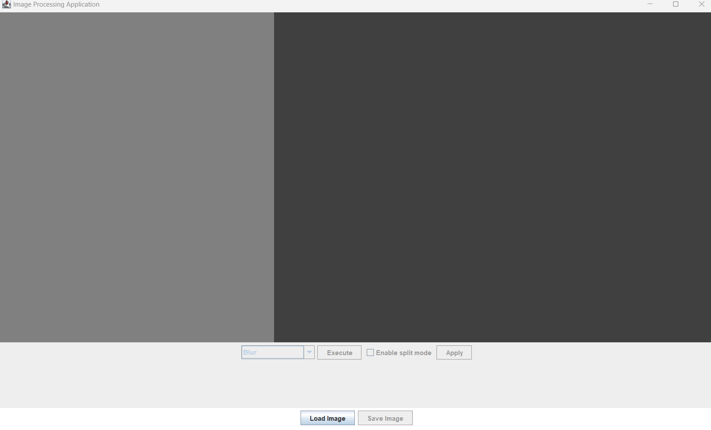
2. **Load Image:**
   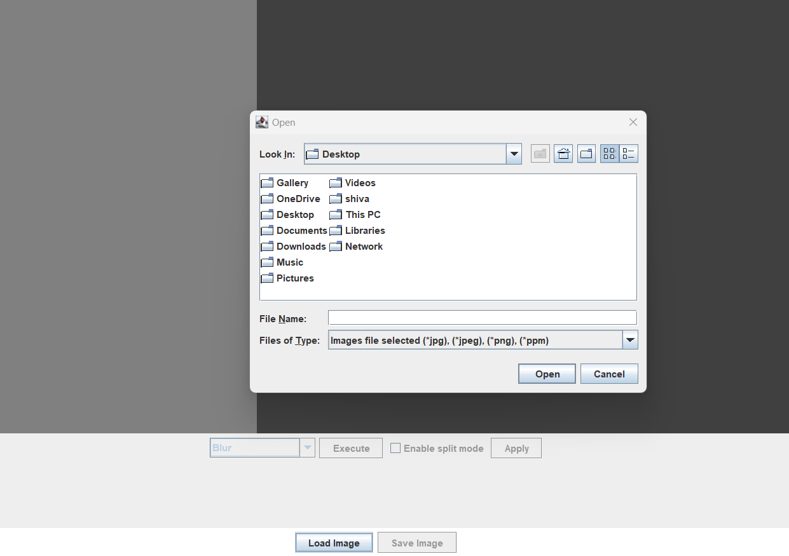
3. **Image Loaded:**
    User can now perform operations on the image. If the image is bigger than the screen, the image is shown with scroll bars.
   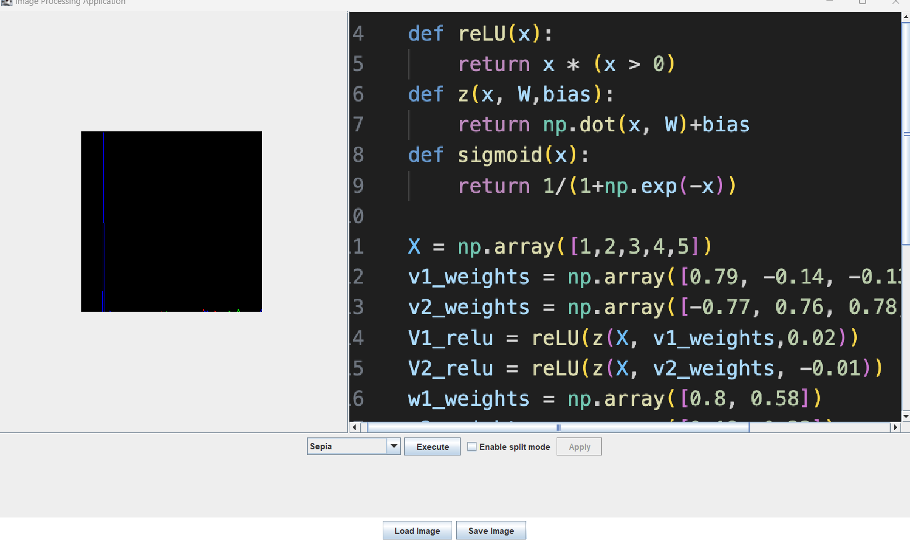
4. **Split view:** User can view the original image and the modified image side by side.
    Notice that save button is disabled as the user has not performed operation yet.
   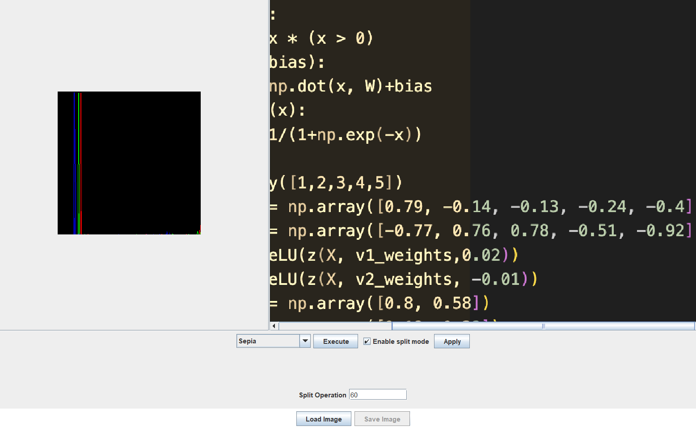
5. **Roll back split:** User can go back to the previous image from split view by toggling the enable split button.
   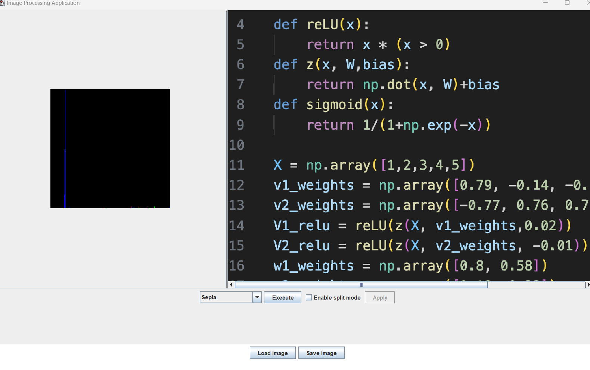
6. **Perform operations on the image:** User can perform operations on the image. Notice that save button is enabled now.
   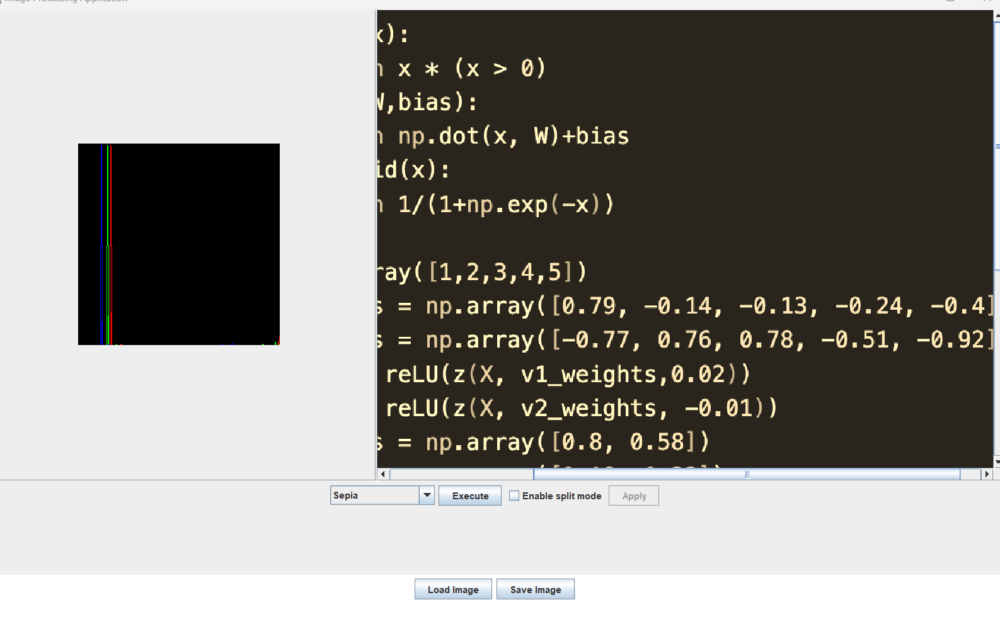
7. **Save Image:** User can save the image by clicking on the save button.
   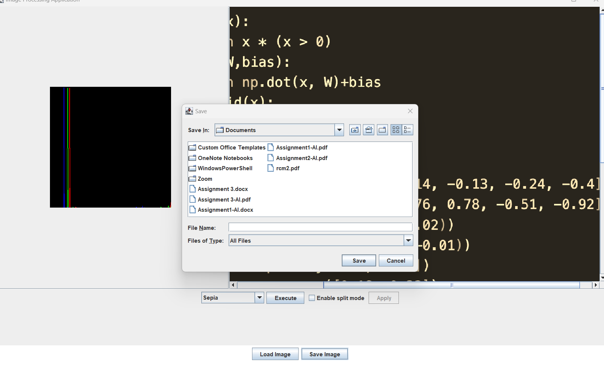
8. Various other operations can be performed on the image as specified earlier.
    E.g. Level Adjustment Operation screenshot:
      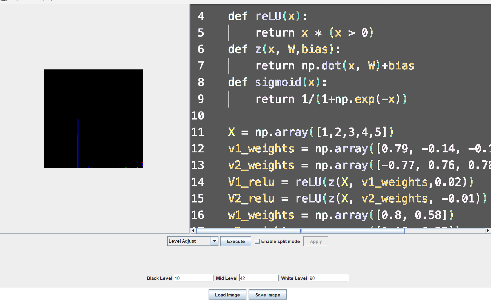
9. Similarly other operations that is vertical and horizontal flip, red, green, blue components, compress can be performed on the image and can be selected from the dropdown.
   Compress needs an additional input of percentage integer to be compressed and the image is compressed by that percentage this needs to be given through the text field.
10. Split mode is supported for sepia, greyscale, blur, sharpen, level adjust, and color correction.
    All of these require an additional input of percentage to be split and the image is split by that percentage this needs to be given through the text field.
    Level Adjust also needs an additional input of integers from black, middle and white intensity values if incorrectly given the user is notified of the same.

**Errors and Warnings Handling:**

There are various error and warning handling mechanisms in place to ensure that the user is notified of any errors that occur.
Some of the errors are:
1. **Load new image without saving:** If the user tries to load a new image without saving the current image, the user is prompted to save the image.
   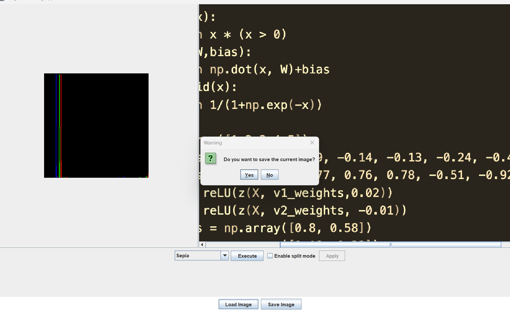
2. **Exit without performing operation:** If the user tries to exit the application without saving the image, the user is prompted to save the image.
   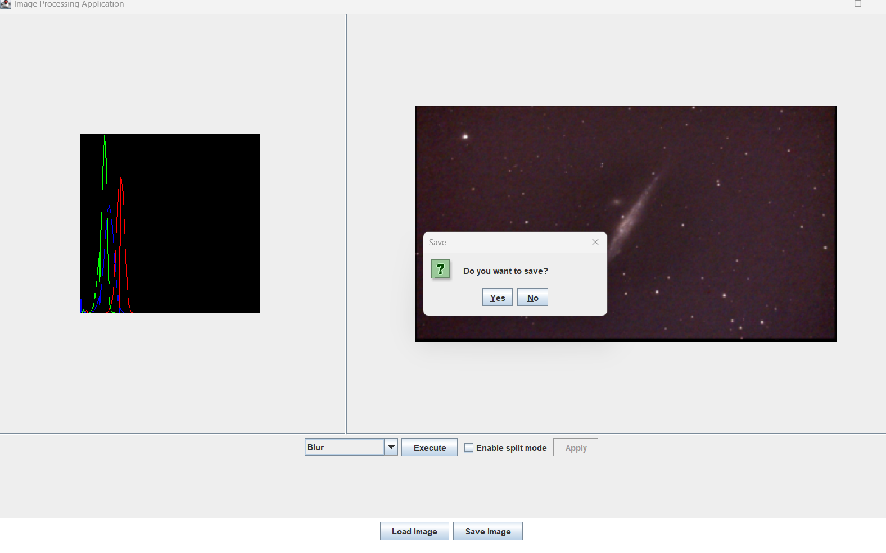
3. If the user tries to give an invalid input
    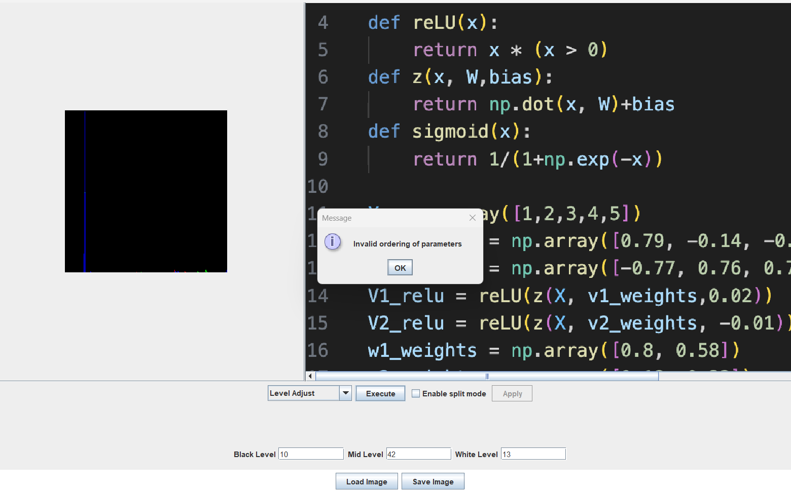


# Command mode: 
**List of Commands Supported:**

   - **Load Image:**
     ```
     load <file-name> 
     ```
     Example: `load res/images/open-source-image-original.png open-source`

   - **Save Image:**
     ```
     save <new-file-name> 
     ```
     Example: `save res/images/open-source-grey-split.png open-source-grey-split`

   - **Blur Image:**
     ```
     blur  <new-img-var-name>
     ```
     Example: `blur open-source open-source-blur split 50`

   - **Sharpen Image:**
     ```
     sharpen  <new-img-var-name>
     ```
     Example: `sharpen open-source open-source-sharpen split 50`

   - **Greyscale Image:**
     ```
     greyscale  <new-img-var-name>
     ```
     Example: `greyscale open-source open-source-grey split 50`

   - **Sepia Effect:**
     ```
     sepia  <new-img-var-name>
     ```
     Example: `sepia open-source open-source-sepia split 50`

   - **Intensity Component:**
     ```
     intensity-component  <new-img-var-name>
     ```
     Example: `intensity-component open-source open-source-intensity`

   - **Value Component:**
     ```
     value-component  <new-img-var-name>
     ```
     Example: `value-component open-source open-source-value`

   - **Luma Effect:**
     ```
     luma-component  <new-img-var-name>
     ```
     Example: `luma-component open-source open-source-luma`

   - **Red, Green, Blue Component:**
     ```
     red-component  <new-img-var-name>
     green-component  <new-img-var-name>
     blue-component  <new-img-var-name>
     ```
     Example:
     ```
     red-component open-source open-source-red
     green-component open-source open-source-green
     blue-component open-source open-source-blue
     ```

   - **Horizontal and Vertical Flip:**
     ```
     horizontal-flip  <new-img-var-name>
     vertical-flip  <new-img-var-name>
     ```
     Example:
     ```
     horizontal-flip open-source open-source-horizontal-flip
     vertical-flip open-source open-source-vertical-flip
     ```

   - **Combine Multiple Images:**
     ```
     rgb-combine <new-img-var-name>   
     ```
     Example: `rgb-combine open-source-combine open-source-red open-source-green open-source-blue`

   - **Split Image:**
     ```
     rgb-split  <new-img-var-name1> <new-img-var-name2> <new-img-var-name3>
     ```
     Example: `rgb-split open-source open-source-red-split open-source-green-split open-source-blue-split`

   - **Compress Image:**
     ```
     compress <percentage-int>  <new-img-var-name>
     ```
     Example: `compress 50 open-source open-source-compress`

   - **Histogram of Image:**
     ```
     histogram  <new-img-var-name>
     ```
     Example: `histogram open-source open-source-histogram`

   - **Levels Adjust of Image:**
     ```
     levels-adjust  <new-img-var-name> <black-int> <middle-int> <white-int>
     ```
     Example: `levels-adjust open-source open-source-levels-adjust 100 200 300 split 50`

   - **Color Correction of Image:**
     ```
     color-correct  <new-img-var-name>
     ```
     Example: `color-correct open-source open-source-color-correct split 50`
